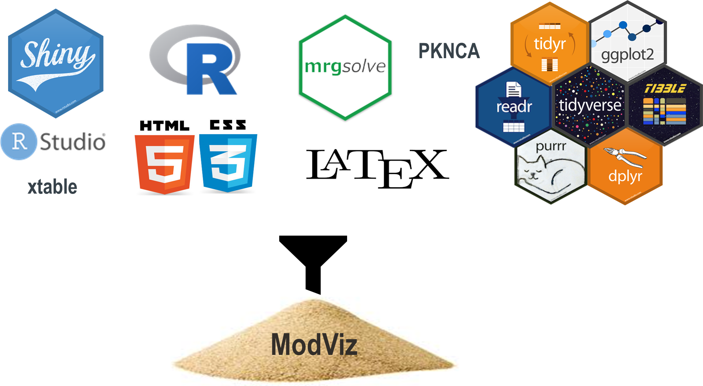

# ModVizPop
### R Shiny Based Interface for Empowering Teams to Perform Real-Time Pharmacokinetic/Pharmacodynamic Simulations

ModVizPop is an interactive and dynamic visualization tool 
developed for simulating differential equation based population PK/PD 
models with variability. It has an in built PK/PD ODE library of models
to choose from alongside ability to plug in a user defined model from 
local or project directory. The user interface consists of several key 
inputs for performing the simulations as well as options to visualize the 
plots, input parameters, derived values and equations. It also provides 
the ability to download the underlying model, plots, simulated data or a 
comprehensive report consisting of all the key inputs and outputs of the 
simulations. The interface includes advanced features where users can overlay 
external data on a simulation, set a certain simulation scenario as a 
reference or carry out sensitivity analysis based simulations. This easy to 
use interface can serve as a valuable tool to project teams to evaluate 
potential scenarios facilitating collaborative decision making in the drug 
discovery and development paradigm.




## Installation
As this package is not currently on CRAN, install it via devtools:

```r
devtools::install_github("PavanVaddady/modvizpop")
```

## Access App

```r
library(modvizpop)
runmodvizpop()
```

## Demonstration


## Publications and Posters

1. [ModViz POP: R Shiny-Based PK/PD Interface for Empowering Teams to Perform Real-Time Simulations](./inst/shiny-apps/myapp/www/Posters/Vaddady_ACOP2018_ModViz.pdf)

2. [Comparison of PK/PD simulations using ModVizPOP, an R-Shiny based PK/PD interface and NONMEM](./inst/shiny-apps/myapp/www/Posters/Ananthula_ACOP2019_ModViz.pdf)